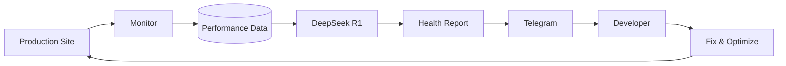

# 🤖 Oval Sentinel AI Agent

[](https://nodejs.org)
[](https://developer.mozilla.org/en-US/docs/Web/JavaScript)
[](https://deepseek.com)
[](https://railway.app)

> **An autonomous 24/7 AI-powered site reliability agent** — monitors production uptime, analyzes performance metrics, and delivers intelligent health reports via Telegram. Built for the Oval Palace Resort production environment.

---

## 📖 Overview

Oval Sentinel is a proactive **SRE (Site Reliability Engineering) bot** that continuously monitors the production website and generates human-readable diagnostics using the DeepSeek Reasoner (R1) model. Instead of drowning in raw numbers, you get intelligent, conversational reports that tell you exactly what's happening and what to do about it.

### Why This Exists

Traditional monitoring tools (Pingdom, UptimeRobot) send alerts but don't diagnose. Oval Sentinel bridges the gap between monitoring and debugging — it analyzes the data and tells you *why* latency spiked or a page slowed down.

---

## ✨ Features

### Core Monitoring
| Feature | Description |
|---------|-------------|
| 🔄 **24/7 Uptime Monitoring** | Pings production site at configurable intervals |
| 📊 **Latency Tracking** | Measures response times, identifies spikes |
| 🧠 **AI Diagnostics** | DeepSeek R1 analyzes metrics → actionable reports |
| 📱 **Telegram Integration** | Daily reports + on-demand commands via Telegram bot |

### Commands
| Command | Action |
|---------|--------|
| `/status` | Instant live ping & latency test |
| `/report` | Force immediate AI analysis of current performance |

---

## 🛠️ Tech Stack

| Technology | Purpose |
|------------|---------|
| Node.js | Runtime & async I/O |
| node-telegram-bot-api | Telegram bot integration |
| axios | HTTP requests & monitoring pings |
| node-cron | Scheduled task execution |
| DeepSeek R1 | AI analysis of metrics & diagnostics |

---

## 🚀 Deployment (Railway)

This repository is optimized for **one-click deployment** on [Railway.app](https://railway.app/).

### Required Environment Variables

| Variable | Description |
|----------|-------------|
| `TELEGRAM_BOT_TOKEN` | Bot token from @BotFather |
| `DEEPSEEK_API_KEY` | DeepSeek API key for AI analysis |

### Quick Deploy

```bash
# 1. Fork this repo
# 2. Connect to Railway
# 3. Add environment variables
# 4. Deploy — the bot starts automatically
```

---

## 📁 Project Structure

```
Oval-Sentinel-Agent/
├── index.js           # Main entry point
├── bot.js             # Telegram bot logic
├── monitor.js         # Ping & latency monitoring
├── analyzer.js        # DeepSeek AI integration
├── scheduler.js       # Cron job scheduling
└── config.js          # Environment config
```

---

## 🧠 How It Works



1. **Monitor** pings the production site every N minutes
2. **Data** (latency, status code, response size) is collected
3. **DeepSeek R1** analyzes the data and generates a natural-language report
4. **Telegram bot** delivers the report to your chat
5. **You** take action based on AI recommendations

---

## 🖼️ Screenshots

*Coming soon — Telegram chat example, dashboard view*

---

## 🌐 Links

- **GitHub**: [mishel-0/Oval-Sentinel-Agent](https://github.com/mishel-0/Oval-Sentinel-Agent)
- **Report Issues**: [Open an issue](https://github.com/mishel-0/Oval-Sentinel-Agent/issues)

---

<p align="center">
  <i>Built for 24/7 peace of mind</i>
</p>